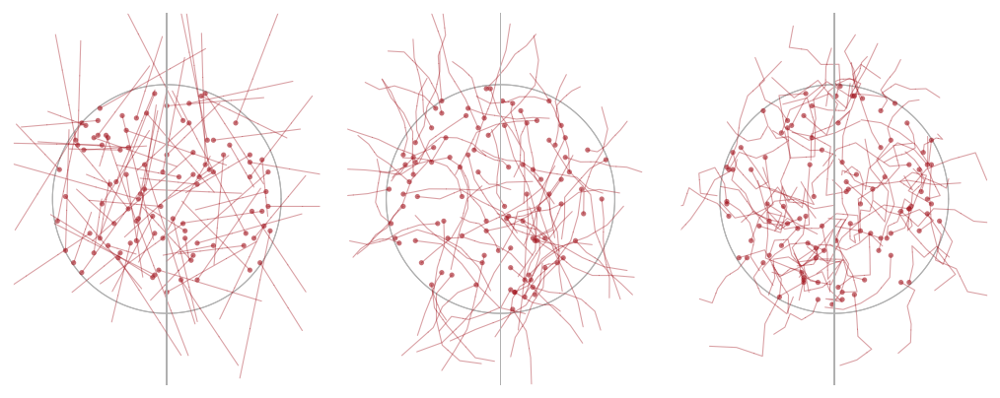

```{r, include = FALSE}
knitr::opts_chunk$set(
  collapse = TRUE,
  comment = "#>"
)

#setwd(dirname(rstudioapi::getActiveDocumentContext()$path))
```

This vignette describes our analysis in a step-by-step guide.  

## Setup

**1.Setup this directory** on your local computer by either cloning this repo via `git` or downloading it as a zipped folder.  

**2. Start a new script** in `RStudio` and save it within this directory's `R` folder.  

**3. Load libraries** at the top of your script. Install the packages you don't yet have.  

```{r,message=FALSE}
library(rstudioapi)
library(dplyr)
library(truncnorm)
library(solartime)
library(boot)
library(DescTools)
library(sf)
#library(matlib)
#library(manipulateWidget)
```

**4. Source functions** at the top of your script. 

```{r}
source("function-ais.R")
source("function-simulator.R")
source("function-impacts.R")
source("function-results.R")
```

## Marine traffic data

### Formatting AIS 

Subsequent steps will require AIS data that meet the following criteria: 

- Each row contains details for a single vessel.
- There is a column named `id`, containing a unique identifier for each vessel (e.g., MMSI).  
- There is a column named `type`, containing the category or class of vessel.  
- There is a column named `sog`, containing speed-over-ground in meters per second.  
- There is a column named `length`, containing vessel length in meters.  
- There are columns named `year` (e.g., 2018), `month` (e.g., 7 for July), and `doy` for day-of-year (e.g., 182 for July 1st).  
- There is a column named `hour` for the local hour of day in which this record occurred.  
- There are columns named `x` and `y` for longitude and latitude, respectively, in decimal degrees.  
- Records for each unique vessel are filtered to only one per hour. This is to ensure that frequently-reporting vessels are not overrepresented but that vessels that occur often or linger in the area are not underrepresented.  

#### Example script

Here is the code we used to format the raw AIS data provided to us by the Canadian Coast Guard. You may use this dataset to familiarize yourself with the simulator.  

First, read in the raw data:  

```{r,echo=TRUE,eval=TRUE, collapse=TRUE}
ais <- read.csv("../data/ais/ais-2018.csv")
```

Check out the AIS data in its raw form:  

```{r,echo=TRUE,eval=TRUE, collapse=TRUE}
nrow(ais)

head(ais)
```

Now save only certain fields to a new dataframe, modifying column names and in some case changing units: 

```{r,echo=TRUE,eval=TRUE, collapse=TRUE}
ais <- data.frame(id=ais$ID,
                  type=ais$Type,
                  sog=(ais$SOG*0.5144), 
                  length=ais$Length, 
                  year=ais$Year,
                  month=ais$month, 
                  hour=as.numeric(gsub(":","",substr(ais$time,1,2))),
                  doy=as.numeric(strftime(ais$Local.Time,format="%j")),
                  time=as.POSIXct(ais$Local.Time),
                  x=ais$Longitude,
                  y=ais$Latitude)
```

Now we filter the record so that each vessel is included only once per hour at most. 

```{r,echo=TRUE,eval=TRUE, collapse=TRUE}
ais$id_hour <- paste0(ais$id,'-',ais$hour)
ais <- ais[! duplicated(ais$id_hour),]
ais$id_hour <- NULL
nrow(ais)
```

Optionally, add columns for the elevation of the sun during each record.  This would prove useful if you want to conduct ship-strike assessments in a circadian-explicit framework (daytime vs. nighttime risks and impacts).  

```{r,echo=TRUE,eval=TRUE, collapse=TRUE}
ais$sol <- solartime::computeSunPositionDoyHour(doy=ais$doy,
                                 hour=ais$hour,
                                 latDeg=ais$y,
                                 longDeg=ais$x,
                                 timeZone=-7)[,3] * (180/pi)
```

You can then use solar elevation to determine which events occur during day (`sol` > 0) and which during night (`sol` < 0). Note that some studies have used civil twilight or other metrics to draw this distinction.  Here we are just keeping things simple.  

```{r,echo=TRUE,eval=TRUE, collapse=TRUE}
ais$night <- 0
ais$night[ais$sol < 0] <- 1
```

This is the resulting dataframe that will get passed to subsequent steps:  

```{r,echo=TRUE,eval=TRUE, collapse=TRUE}
# Check out result
head(ais)
```

## Prepare parameters for simulator

### Marine traffic

First, filter the AIS data to the vessel class of interest (column `type` in the `ais` data frame). You can supply multiple classes if you wish, or skip this step to keep all classes.  

```{r}
traffic <- ais

# Define vessel types of interest
type_ops <- c("cargo ship","tanker") 

# Filter to vessel type
matches <- which(tolower(as.character(ais$type)) %in% type_ops) 
traffic <- traffic[matches,] 
nrow(traffic)
  
# Filter to valid entries
traffic <- traffic %>% dplyr::filter(length > 5,
                                     sog > 2) 

# Filter to study area
traffic <- traffic %>% dplyr::filter(x > -129.6,
                                     x < -129.3,
                                     y > 52.8,
                                     y < 53.35)
nrow(traffic)
```

Now simplify these data to only the essential parameters and add an approximation of vessel width:  

```{r}
params.ship <- traffic %>% 
  dplyr::select(v.ship = sog,
                l.ship = length) %>%
  dplyr::mutate(w.ship = 0.15*l.ship) 
```

Check out the finalized traffic parameter set: 

```{r}
head(params.ship)
```

```{r,fig.width=6, echo=FALSE, eval=FALSE}
# Visualize the distributions of these parameters (there are few values, since traffic in this area is currently quite rare):  
par(mfrow=c(1,3))
par(mar=c(4,4,.5,.5))
hist(params.ship$v.ship,breaks=20,main=NULL)
hist(params.ship$l.ship,breaks=20,main=NULL)
hist(params.ship$w.ship,breaks=20,main=NULL)
```

To **simulate additional traffic** on top of the traffic already present, you can add rows to `params.ship`. This code emulates the traffic increase expected in 2030 in Gitga'at waters:  

```{r}
new_transits <- 750
v.ship <- rep(5.144,times=new_transits)# 10 knots or 0.5144 m/s
l.ship <- rep(300,times=new_transits)
w.ship <- l.ship*0.15
projected.traffic <- data.frame(v.ship,l.ship,w.ship)

params.ship <- rbind(params.ship, projected.traffic)
```

### Whales  

The parameters that characterize a whale in the encounter simulator can be defined as either a single value (e.g., 20 meters), or as a distribution of values from which to draw random values.  In this example, we will do the latter. 

(*Note:* In the published analysis, this code is implemented in `00_whale.R`).  

Define the size of the distributions you will use: 

```{r}
n <- 1000
```

These distributions will be truncated-normal distributions, to ensure that no value is unrealistically small or large.  

#### Whale velocity

Velocity should be provided as meters per second. We draw values from the acoustic tracks of fin whales from the same study area in Hendricks et al. (2021).  

```{r}
v.whale = truncnorm::rtruncnorm(n,
                                a=0,
                                b=2.63,
                                mean=1.3611,
                                sd=.5) 
```

#### Whale directivity

Whale directivity, which we define in our paper as the standard deviation of change in course heading from one minute to the next, is also drawn from Hendricks et al. (2021). In that paper, 62 acoustic tracks of at least 30 minutes duration were analyzed. Refer to `prep_delta_sd.R` for details on how this was determined. Note that, in this analysis, the standard deviation of course changes were log-transformed so that they followed a Gaussian distribution.   

```{r}
# Produce distribution of log-transformed values
delta.sd = rnorm(n, 
                 mean = 1.0424,
                 sd = 0.82477)

# Revert from log-transformed to actual SD of course change
delta.sd <- exp(delta.sd)
```

#### Whale dimensions

Whale length is drawn from UAV-based photogrammetry measurements for fin whales in our study area, published in Keen et al. (2021).  

```{r}
l.whale = truncnorm::rtruncnorm(n = n,  # samples
                                a = 0,  # min
                                b = 40, # max
                                mean = 18.60375,
                                sd = 1.649138) 
```

To estimate whale widths, we use the ratio of fluke width to body length from Keen et al. (2021). 

```{r}
w.whale = .2074
```

Visualize the distributions of these parameters:  

```{r,fig.width=7}
par(mfrow=c(1,3))
par(mar=c(4,4,.5,.5))
hist(v.whale,breaks=20,main=NULL)
hist(l.whale,breaks=20,main=NULL)
hist(delta.sd,breaks=20,main=NULL)
```

## Demo simulator

Check out how the simulator works: 

```{r,echo=TRUE, eval=FALSE}
par(mfrow=c(1,3))
delta.sds <- c(0,20,60)

for(i in 1:3){
sim_b <- encounter_simulator(params.ship=params.ship,
                             v.whale=v.whale,
                             l.whale=l.whale,
                             w.whale=w.whale,
                             delta.sd=delta.sds[i],
                             B=100,
                             save_records=FALSE,
                             speedy=TRUE,
                             verbose=FALSE,
                             toplot=TRUE)
}
```

{width='97%'}


## Run simulator

We are now ready to run our encounter rate simulation. 

Define the filename of the `R` data object that will store your results. 

```{r}
results_filename <- 'demo_results.rds'
```

Define the number of iterations you want. We suggest no fewer than 100.  

```{r}
iterations <- 100
```

Stage empty objects into which results will be placed during each iteration.  

```{r}
encounter_tally <- c() # simple tally of imminent encounters
summaries <- data.frame() # summaries of each iteration
records <- list() # list of detailed info for each imminent encounter
```

Time to begin the simulator! 

```{r,eval=FALSE}
# Loop through iterations  
for(b in 1:iterations){

  # Run simulator
  sim_b <- encounter_simulator(params.ship=params.ship,
                               v.whale=v.whale,
                               l.whale=l.whale,
                               w.whale=w.whale,
                               delta.sd=delta.sd,
                               B=100,
                               save_records=FALSE,
                               speedy=TRUE,
                               verbose=FALSE,
                               toplot=FALSE)

  # Summary of each iteration
  summary_b <- sim_b$summary
  summary_b$iteration <- b
  summary_b

  # Add to summary df for all iterations
  summaries <- rbind(summaries, summary_b)

  # Note number of imminent encounters that occurred in this iteration
  encounters <- which(summary_b$encounter==1)
  tot_encounters <- length(encounters)
  encounter_tally <- c(encounter_tally,tot_encounters)

  # Refresh results storage object
  results_list <- list(encounter_tally = encounter_tally,
                       summaries = summaries)

  if(save_records){
    # Details for each iteration
    records_b <- sim_b$records

    # Get records for runs that results in an encounter
    if(tot_encounters > 0){
      encounter_records <- records_b[encounters]
      length(encounter_records)
      records <- c(records, encounter_records)
    }

    results_list$records <- records
  }

  # Save results object to RDS in each iteration to ensure work is never lost
  saveRDS(results_list,
          file=results_filename)

  # Print status report
  message(Sys.time()," | Iteration ",b," | ",tot_encounters," imminent encounter(s) ...")

}
```

**Processing tips:**  

- To reduce processing time, set `speedy` to `TRUE` and `toplot` to `FALSE`.  

- To get detailed notes on processing time for each step of each simulation run, set `verbose` to `TRUE`.  

- To store detailed records for every run of the simulator -- such as the ship's polygon for every second of every simulation run or the closest proximity of the whale and ship in each run -- set `save_records` to `TRUE`.   

## Process results

Read in your results object:  

```{r,eval=TRUE}
results <- readRDS(results_filename)
```

A few more steps are required to estimate the encounter rate as accurately as possible. These steps can be done in a single line of code using the function `process_results()` in `function-results.R`, but we shall detail them here. 

The key results are in `results$summaries`: 

```{r,eval=TRUE}
head(results$summaries)
```

Note that only runs in which the whale came within 20m of the ship have all details saved. This is because `speedy` was set to `TRUE`; all details would have been provided if `speedy` were set to `FALSE`.  

To make it easier to work with these results, save them as as flat dataframe:  

```{r,eval=TRUE}
mri <- results$summaries 

# Add identifier for each row
mri$id <- 1:nrow(mri) 
```

Since the simulator only tests whether the whale's rostrum occurs within the polygon of the ship, we need to ask whether the rest of the whale's body might have intersected with the ship, based on the whale's length in each run and the whale's heading at the moment of closest proximity.  

First, add a new column for the position of the whale's fluke: 

```{r,eval=TRUE}
mri$whale_dx <- cos(2*pi - (mri$whale_hdg*pi/180) + pi/2)*(mri$whale_l) 
mri$whale_x_fluke <- mri$whale_x + mri$whale_dx
```

Let's also add a column describing where along the length of the ship that whale is occurring, described as a fraction (0 = at the bow, 1 = at the stern). We won't use this variable in this analysis, but it will prove useful in subsequent avoidance analyses. 

```{r,eval=TRUE}
mri$ship_frac <- (mri$ship_y_bow - mri$whale_y) / (mri$ship_y_bow - mri$ship_y_stern)
```

Now let's focus in on the near-misses: the runs in which the whale's rostrum came within the whale's body length of the ship. 

```{r,eval=TRUE}
near_misses <- which(mri$encounter==0 & mri$closest < mri$whale_l)
misses <- mri[near_misses,]
nrow(misses)
```

Now let's inspect each of those near-misses and ask whether it was actually an encounter, based on the whale's body position at the moment of closest proximity. 

```{r,eval=TRUE}
# Stage results vector
hit <- rep(FALSE,nrow(misses))

# Loop through each near-miss
for(i in 1:nrow(misses)){
    missi <- misses[i,]
    
    # Determine ship radius for this near-miss
    ship_rad <- round(missi$ship_w / 2)  ; ship_rad
    
    # Does the whale's fluke occur within the cross-sectional width of the ship?
    hit_test <- round(missi$whale_x_fluke) %in% (-1*ship_rad):ship_rad ; hit_test   

    # Is the whale occurring between the bow and the stern?
    y_test <- round(missi$whale_y) %in% round(missi$ship_y_bow):round(missi$ship_y_stern); y_test
    
    # If both are true, this is actually an encounter
    if(all(c(hit_test,y_test))){hit[i] <- TRUE}
}
```

Based on these results, update the simulation results:
```{r}
hits <- misses[hit,]
to_change <- which(mri$id %in% hits$id)
mri$encounter[to_change] <- 1
```

Now we can re-calculate encounter rates for each iteration:  

```{r}
mrs <- mri %>%
    group_by(iteration) %>%
    summarize(encounters=sum(encounter))
```

Visualize:  

```{r,fig.width=5}
par(mar=c(4.2,4.2,2,1))
hist(mrs$encounters,
       breaks=seq(0,20,by=1),
       main='Imminent encounters per 100 runs')
```

Calculate statistics:  

```{r}
# Mean encounter rate
round(mean(mrs$encounters),digits=3)

# SD encounter rate
round(sd(mrs$encounters),digits=3)

# 95% confidence interval of the mean
BootCI(mrs$encounters,FUN=mean)[2:3]

# 90% range of encounter rates
quantile(mrs$encounters,c(0.05,0.95))
```

